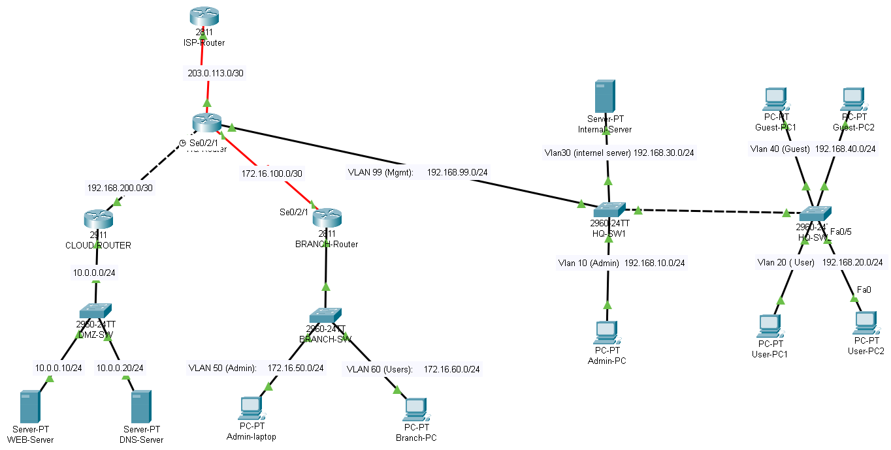

# 🔒 Secure Enterprise Network Project

## Overview
This project was designed and implemented as a hands-on CCNA-level network
to practice realistic enterprise security concepts such as segmentation,
access control, and secure routing.

The network simulates a company with a Headquarter, Branch office,
DMZ, Cloud integration, and controlled Internet access.

---

## Objectives
- Implement VLAN segmentation for security and performance.
- Apply ACLs to enforce least-privilege access.
- Configure OSPF with MD5 authentication for secure routing.
- Use NAT (PAT & Static) for Internet access and service exposure.
- Secure device management via SSH and port security.

---

## Technologies Used
- Cisco IOS (Router & Switch)
- VLANs & Trunking (802.1Q)
- OSPF with MD5 Authentication
- Access Control Lists (ACLs)
- NAT (Overload & Static)
- Port Security & SSH

  ---
  
## Topology

---

## Key Implementations

- **VLAN Segmentation**  
  Separate VLANs were used for Users, Servers, Guest, and Management networks
  to reduce broadcast traffic and improve security.

- **Access Control Lists (ACLs)**  
  Extended ACLs were applied inbound on router interfaces to control
  inter-VLAN traffic and Internet access based on least privilege.

- **Network Address Translation (NAT)**  
  PAT (overload) is used for internal user Internet access, while Static NAT
  is configured for DMZ services that must be reachable from outside.

- **OSPF Routing with Authentication**  
  OSPF is used for dynamic routing between HQ, Branch, and Cloud routers.
  MD5 authentication is enabled to protect routing updates.

- **Secure Device Management (SSH)**  
  All devices are managed using SSH only. VTY access is restricted
  using standard ACLs.

- **Port Security**  
  Port security is enabled on access switch ports to limit the number
  of allowed MAC addresses and prevent unauthorized access.

---

## Verification

The following commands were used during testing to verify that each feature
was working as intended:

- VLANs: `show vlan brief`
- Trunk links: `show interfaces trunk`
- Port security: `show port-security interface`
- ACLs: `show access-lists`
- NAT: `show ip nat translations`
- OSPF: `show ip ospf neighbor`
- SSH: `show ip ssh`

Screenshots of all verification steps are included in the `03-Screenshots` folder.

---

## Limitations

- Advanced security controls such as firewall zones, IDS/IPS, and centralized
  logging were not implemented due to the CCNA-level scope of the project.
- The design focuses on foundational network security and segmentation concepts.
- The project can be extended to cloud environments using VPC subnets,
  security groups, and routing tables.

---

## Repository Structure

Secure-Enterprise-Network-CCNA/
│
├── 01-Topology/ # Network topology screenshots
├── 02-Configs/ # Router and switch configurations
├── 03-Screenshots/ # Verification screenshots
├── 04-Documentation/ # Network design documentation
└── README.md # Project overview

---

## Lessons Learned
- How to segment networks using VLANs.
- The importance of applying ACLs close to the source.
- How OSPF authentication prevents rogue router attacks.
